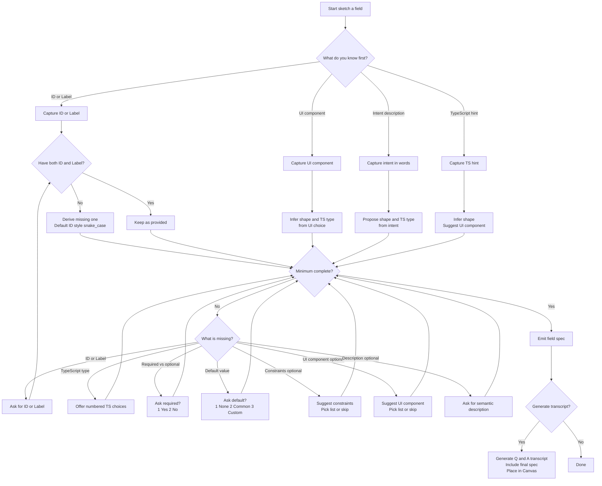

```mermaid
flowchart TD
  A[Start sketch a field] --> B{What do you know first?}

  %% Entry points
  B -->|ID or Label| C1[Capture ID or Label]
  B -->|UI component| C2[Capture UI component]
  B -->|Intent description| C3[Capture intent in words]
  B -->|TypeScript hint| C4[Capture TS hint]

  %% Normalize ID and Label
  C1 --> N1{Have both ID and Label?}
  N1 -->|No| N2[Derive missing one
Default ID style snake_case]
  N1 -->|Yes| N3[Keep as provided]
  N2 --> R0
  N3 --> R0

  %% UI-first inference
  C2 --> U1[Infer shape and TS type
from UI choice]
  U1 --> R0

  %% Intent-first inference
  C3 --> I1[Propose shape and TS type
from intent]
  I1 --> R0

  %% TS-first inference
  C4 --> T1[Infer shape
Suggest UI component]
  T1 --> R0

  %% Resolution loop
  R0{Minimum complete?}
  R0 -->|No| R1{What is missing?}

  %% Missing pieces
  R1 -->|ID or Label| Q1[Ask for ID or Label]
  R1 -->|TypeScript type| Q2[Offer numbered TS choices]
  R1 -->|Required vs optional| Q3[Ask required?
1 Yes 2 No]
  R1 -->|Default value| Q4[Ask default?
1 None 2 Common 3 Custom]
  R1 -->|Constraints optional| Q5[Suggest constraints
Pick list or skip]
  R1 -->|UI component optional| Q6[Suggest UI component
Pick list or skip]
  R1 -->|Description optional| Q7[Ask for semantic description]

  %% Feed back
  Q1 --> N1
  Q2 --> R0
  Q3 --> R0
  Q4 --> R0
  Q5 --> R0
  Q6 --> R0
  Q7 --> R0

  %% Completion
  R0 -->|Yes| Z1[Emit field spec]
  Z1 --> Z2{Generate transcript?}
  Z2 -->|Yes| Z3[Generate Q and A transcript
Include final spec
Place in Canvas]
  Z2 -->|No| Z4[Done]
```

